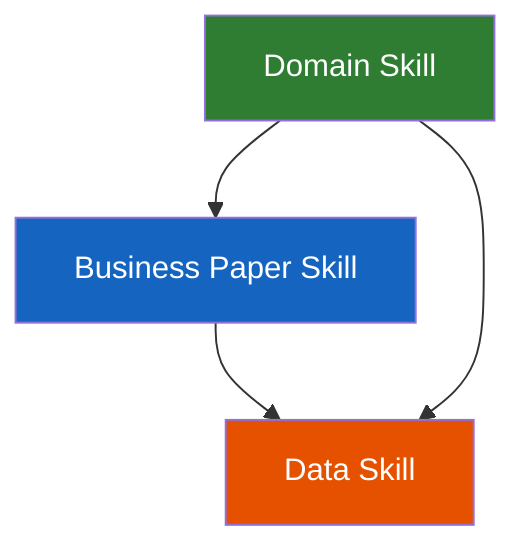

# 📝 Business Paper Skill

An agent skill for writing high-quality business papers in markdown — strategy papers, business cases, architecture documents, analytics reports, product briefs, and operational summaries. Compatible with [Claude Code](https://docs.anthropic.com/en/docs/claude-code), [Cursor](https://cursor.com), [Cline](https://cline.bot), [OpenCode](https://github.com/opencode-ai/opencode), and any coding agent that supports the [skills standard](https://github.com/vercel-labs/skills).

## What it does

This skill teaches your AI agent how to write business papers that are structured, evidence-based, and formatted for professional audiences. It handles the hard parts — structure selection, audience layering, data presentation, and quality assurance — so the analyst focuses on insight and narrative.

### Six paper types

- **Business Case** — justify investments with financial models, options analysis, and clear recommendations
- **Architecture Paper** — describe systems, data flows, and phased delivery plans
- **Strategy Paper** — build compelling cases for change with SCQA narrative structure
- **Product Brief** — define scope, constraints, and open questions for new initiatives
- **Operational Summary** — capture decisions, actions, and owners from meetings and reviews
- **Analytics Report** — present data-driven findings with takeaway headlines and trend analysis

### Writing principles built in

- **Pyramid Principle** — conclusion first at every level (paper, section, paragraph)
- **SCQA** — Situation, Complication, Question, Answer for persuasive narrative structure
- **Data Storytelling** — takeaway titles, annotated insights, context for every number
- **Visual Rhythm** — tables and mermaid diagrams every 1–2 pages for scannability

### Designed to layer

This skill provides general writing guidance. Domain-specific skills layer on top with org-specific terminology, data sources, and templates. The three-layer stack:



## Installation

### Via skills CLI ([vercel-labs/skills](https://github.com/vercel-labs/skills))

```bash
npx skills add onsen-ai/hb-agent-skills/skills/writing/business-paper -a claude-code
npx skills add onsen-ai/hb-agent-skills/skills/writing/business-paper -a cursor
```

### Manual install

```bash
# Claude Code
git clone https://git.example.com/example/agent-skills.git
cp -r agent-skills/skills/writing/business-paper ~/.claude/skills/business-paper

# Cursor
cp -r hb-agent-skills/skills/writing/business-paper .cursor/skills/business-paper
```

> 💡 Most agents discover skills automatically from their skills directory — no extra config needed.

## What's included

```
├── SKILL.md                         # Skill definition (~450 lines)
├── references/
│   ├── paper-types.md               # Detailed per-type section structures
│   ├── mermaid-patterns.md          # 7 reusable diagram patterns with code
│   ├── tables-and-data.md           # 7 table patterns with examples
│   └── quality-checklist.md         # Pre-publication quality checklist
```

### Progressive disclosure

The skill uses a layered loading approach:

1. **SKILL.md** (~450 lines) — always in context. Covers paper taxonomy, writing process, principles, formatting, anti-patterns
2. **Reference files** — loaded on demand when the agent needs specific patterns:
   - `paper-types.md` when building a skeleton for a specific type
   - `mermaid-patterns.md` when adding diagrams
   - `tables-and-data.md` when presenting data
   - `quality-checklist.md` before finalising

## Usage examples

```
# Write a business case
"Write a business case for investing in a customer data platform.
Budget is around £500k, payback expected in 18 months."

# Draft an architecture paper
"Create an architecture document for our new event-driven data pipeline.
It ingests from Kafka, transforms in Spark, and lands in the warehouse."

# Produce a trading update
"Write a weekly trading performance report for Week 12.
Here's the data: [paste or query results]"

# Improve an existing paper
"Review this strategy paper and improve the structure, add
an executive summary, and make the recommendations sharper."
```

## How it works

Business papers fail when they lack structure, bury the conclusion, present data without insight, or skip the quality basics (scope, assumptions, next steps). This skill:

1. **Identifies the paper type** from the user's request and loads the right section structure
2. **Enforces a writing process** — clarify intent, build skeleton, get approval, write progressively
3. **Applies proven frameworks** — Pyramid Principle, SCQA, data storytelling — adapted for markdown
4. **Provides formatting standards** — tables, mermaid diagrams, financial notation, heading hierarchy
5. **Runs a quality checklist** before delivery — catching structural and formatting issues

## Contributing

Issues and PRs welcome. The most impactful contributions:

- Additional paper type templates in `references/paper-types.md`
- New mermaid patterns in `references/mermaid-patterns.md`
- Quality checklist refinements

## License

MIT
