# Mermaid Pattern Library

Copy-paste mermaid examples for business papers. Pick the pattern that fits your content and adapt it.

**A few things that tend to work well:**

- One concept per diagram — split rather than overload
- Give each diagram a descriptive title (heading or bold text above the code block)
- Keep to 15–20 nodes max for readability
- Use consistent colour coding within a paper (see the colour convention below)
- For line breaks in node labels, use `<br>` not `\n` — mermaid renders `\n` literally
- **Avoid mermaid bar/xychart for negative values** — they don't render negatives well (bars may not display below zero, axis labels get clipped). Use a **markdown table** instead for data with negative values (e.g., variance charts, waterfall contributions). Mermaid bar charts work well for positive-only comparisons (e.g., sales by market, category contribution).

---

## Theme and colour convention

### Theme

Use mermaid's **default** theme (no `theme:` config needed). It provides a clean blue/purple baseline that renders well across markdown previewers. Then use the H&B accent colours to make key elements pop.

### H&B accent colours

Suggested accent palette — use these to draw the reader's eye to what matters (recommended option, key finding, alert). Everything else stays default.

| Purpose               | Colour     | Hex       | Text   |
| --------------------- | ---------- | --------- | ------ |
| Primary highlight     | H&B Green  | `#9BC437` | `#000` |
| Secondary accent      | Steel Blue | `#1565c0` | `#fff` |
| Alert / negative      | Deep Red   | `#c62828` | `#fff` |

**Visual accent palette:**

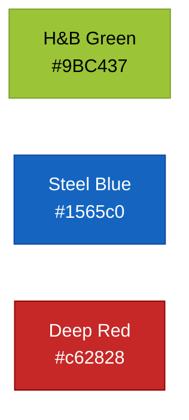

Apply accents with `style` on specific nodes or `classDef` for reuse — let the default theme handle everything else:

```text
%% Inline — for one-off highlights
style ImportantNode fill:#9BC437,color:#000
style AlertNode fill:#c62828,color:#fff

%% classDef — for reuse across a diagram
classDef highlight fill:#9BC437,color:#000
classDef alert fill:#c62828,color:#fff
class NodeA,NodeB highlight
```

> **Colour-blind safety tips:** Never rely on colour alone to convey meaning — always pair with labels, patterns, or icons. When using red/green together (e.g., pass/fail), add ✅/❌ icons. In charts, `showDataLabel: true` ensures values are readable regardless of colour perception.

---

## 1. Process flow

**When to use:** Approval workflows, decision processes, step-by-step procedures.

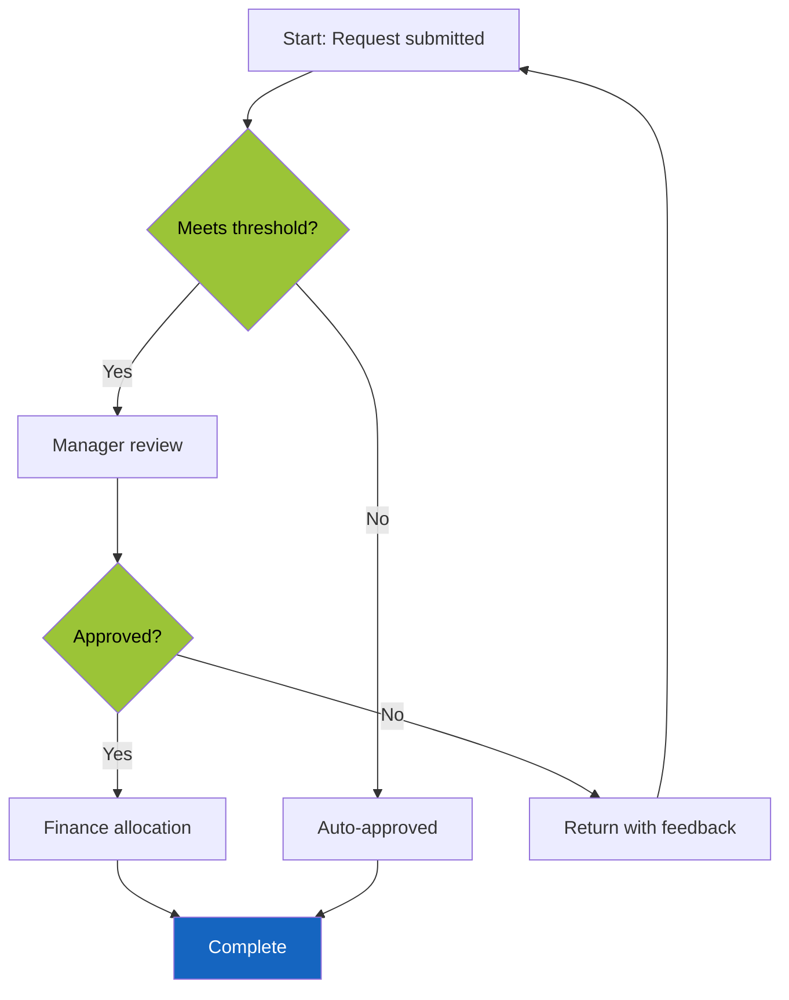

**Tips:**

- Diamond shapes `{}` for decisions — colour them H&B Green so they stand out from action boxes
- Keep the happy path straight (top to bottom)
- Use Steel Blue for secondary highlights (e.g., outcome nodes like "Complete")
- Label arrows with the decision outcome (`|Yes|`, `|No|`)

---

## 2. System architecture (layered)

**When to use:** Architecture papers, system overviews, showing component relationships across layers.

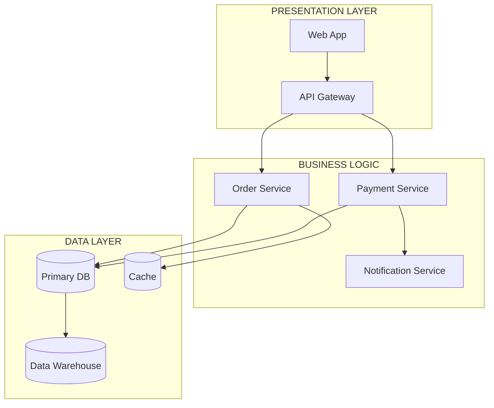

**Tips:**

- Use `subgraph` for layers — label them clearly
- Optionally colour nodes by layer using accent colours (e.g., `style UI fill:#9BC437,color:#000`) — useful when layers need visual distinction, but the default theme already differentiates subgraphs
- Keep arrows flowing top-down (TD) for hierarchies, left-right (LR) for peer-to-peer
- Databases use cylinder notation `[()]`
- Group by responsibility, not by technology

---

## 3. Sequence diagram

**When to use:** API interactions, data pipeline steps, request/response flows between systems.

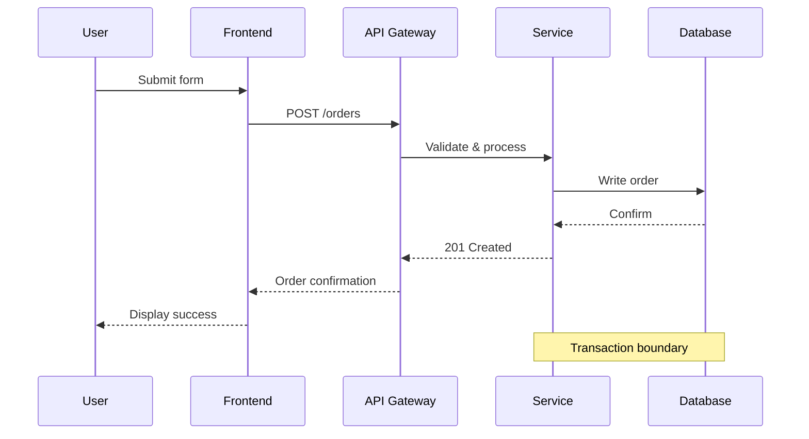

**Tips:**

- Solid arrows (`->>`) for requests, dashed (`-->>`) for responses
- Use `Note over` for annotations that span participants
- Keep to 8–12 steps; split longer flows into multiple diagrams
- Name participants with short aliases and full names: `participant U as User`

---

## 4. Timeline / Gantt

**When to use:** Project roadmaps, phased delivery plans, implementation timelines.

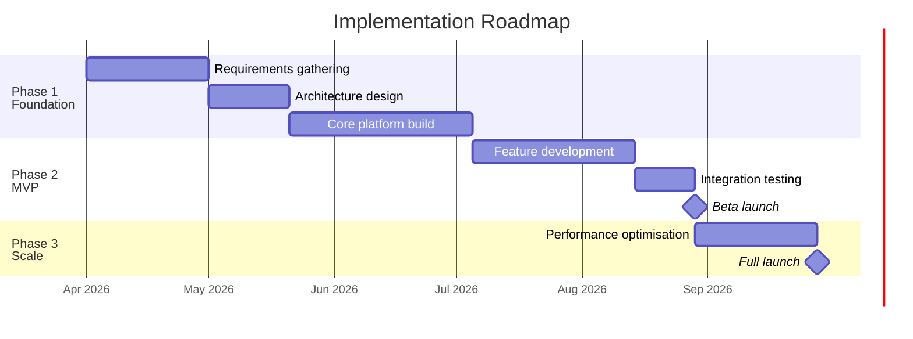

**Tips:**

- Use `section` for phases — each phase should deliver usable value
- Mark key moments with `milestone`
- Keep to 3–4 phases; more granularity goes in a project plan, not a paper
- Use `after` dependencies to show sequencing

---

## 5. Mind map

**When to use:** Capability decompositions, team structures, taxonomy breakdowns, strategic pillars.

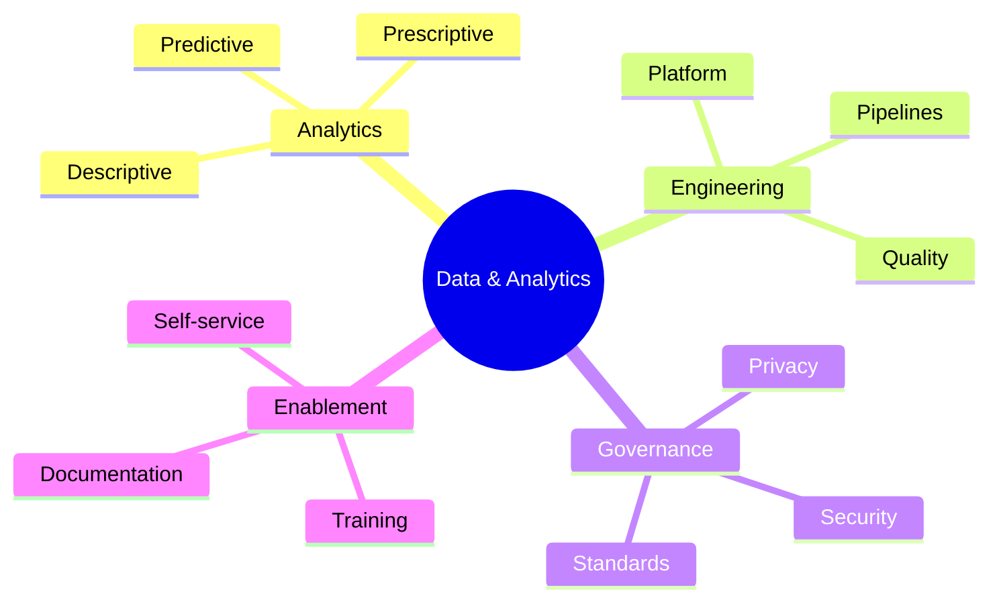

> **Note:** Mindmaps don't support per-node colour styling. The default theme gives a clean result here. If you need brand colours on individual branches, use a flowchart with `classDef` instead.

**Tips:**

- Use `root(())` for the central concept (double parentheses for rounded shape)
- Keep to 3–4 branches from root, 3–5 leaves per branch
- Good for showing "what's in scope" at a glance
- Not suitable for showing relationships or flows — use flowchart instead

---

## 6. Quadrant chart

**When to use:** Strategic positioning, priority matrices, 2×2 analysis (effort vs impact, risk vs reward).

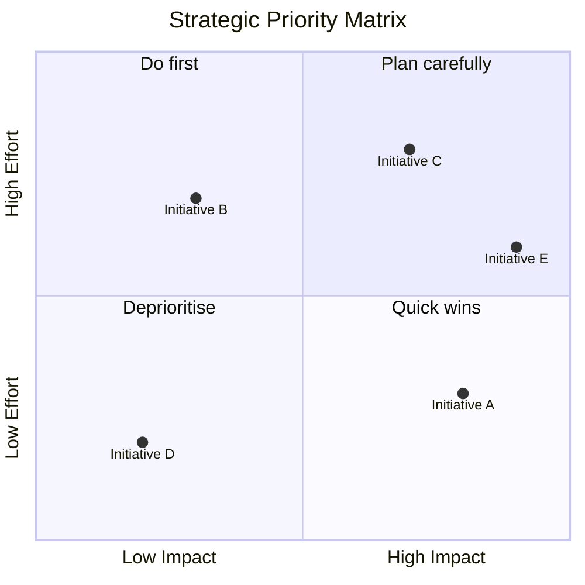

**Tips:**

- Label quadrants with action verbs ("Do first", "Deprioritise")
- Coordinates are 0–1 on each axis
- Keep to 5–8 items; more than that and the chart becomes cluttered
- Always label both axes with the low→high direction

---

## 7. Bar chart (vertical)

**When to use:** Comparing values across categories — revenue by channel, headcount by team, scores by option. The default chart for most business comparisons.

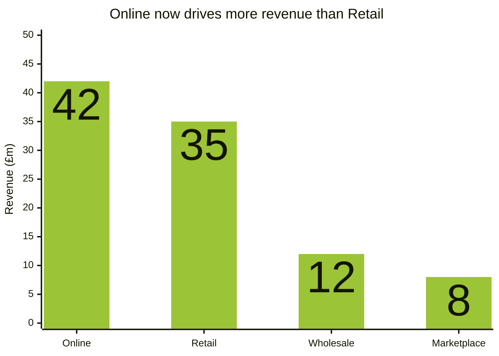

**Tips:**

- **Title = insight, not description.** "Online now drives more revenue than Retail" tells the reader what to think. "Revenue by Channel" just labels what they can already see.
- Label `x-axis` with category names and `y-axis` with the metric and unit
- Set the y-axis range explicitly (`0 --> 50`) to control scale — always start at 0 for bar charts to avoid misleading proportions
- Keep to 4–8 categories; more than that and the labels become unreadable
- For time series, prefer a line chart (see below); bars work best for discrete categories
- Use `showDataLabel: true` in the config frontmatter to display values on bars
- Use `plotColorPalette` with H&B accent colours to give charts brand-consistent colour

---

## 8. Horizontal bar chart

**When to use:** Ranked lists, comparisons with long category labels — e.g., team names, initiative names, product lines.

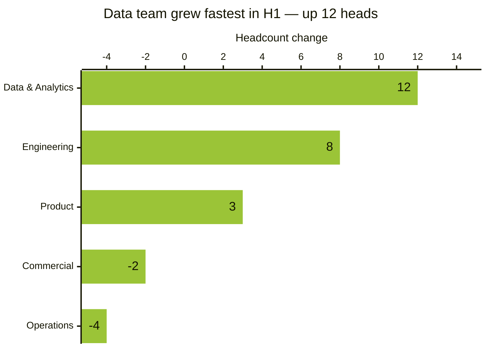

**Tips:**

- Use `chartOrientation: horizontal` — much easier to read when labels are long
- Works well for ranked data where order matters (sort bars by value)
- Negative values render naturally — good for showing gains vs losses

---

## 9. Multi-series bar chart

**When to use:** Comparing two metrics side-by-side across categories — cost vs revenue, actual vs budget, this year vs last year.

Use `chartOrientation: horizontal` for horizontal bars (useful when category labels are long).

```mermaid
---
config:
    xyChart:
        showDataLabel: true
        chartOrientation: horizontal
    themeVariables:
        xyChart:
            plotColorPalette: "#9BC437, #cccccc"
---
xychart
    title "Engineering is the only division spending more than it earns"
    x-axis ["Data", "Engineering", "Product", "Operations"]
    y-axis "£m" 0 --> 30
    bar "Revenue" [25, 18, 22, 15]
    bar "Cost" [12, 20, 14, 16]
```

**Tips:**

- When comparing two series, name each `bar` with a label — this acts as the legend
- Use `plotColorPalette` with comma-separated hex values to assign colours to each series
- Use `chartOrientation: horizontal` when category labels are long or when you have many categories
- If mermaid grouping doesn't render cleanly, fall back to a comparison table — tables handle multi-series data more reliably

---

## 10. Line chart (trends)

**When to use:** Time series, trends over periods, showing trajectory and direction.

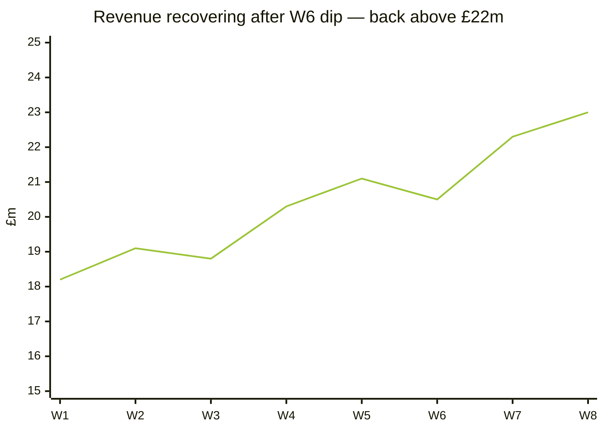

**Tips:**

- Always label both axes with units
- Use `showDataLabel: true` to display values at each data point
- Use `plotColorPalette` to set a darker line colour for better contrast against white backgrounds
- For trends, the y-axis does NOT need to start at 0 — truncating is acceptable when showing change over time (unlike bar charts where it's misleading)
- Keep to 6–12 data points; more granularity goes in an appendix table
- Combine with `bar` in the same chart to overlay (e.g., revenue bars + margin line)

---

## 11. Combined bar + line chart

**When to use:** Showing a primary metric (bars) alongside a rate or ratio (line) — e.g., revenue + margin, headcount + cost-per-head.

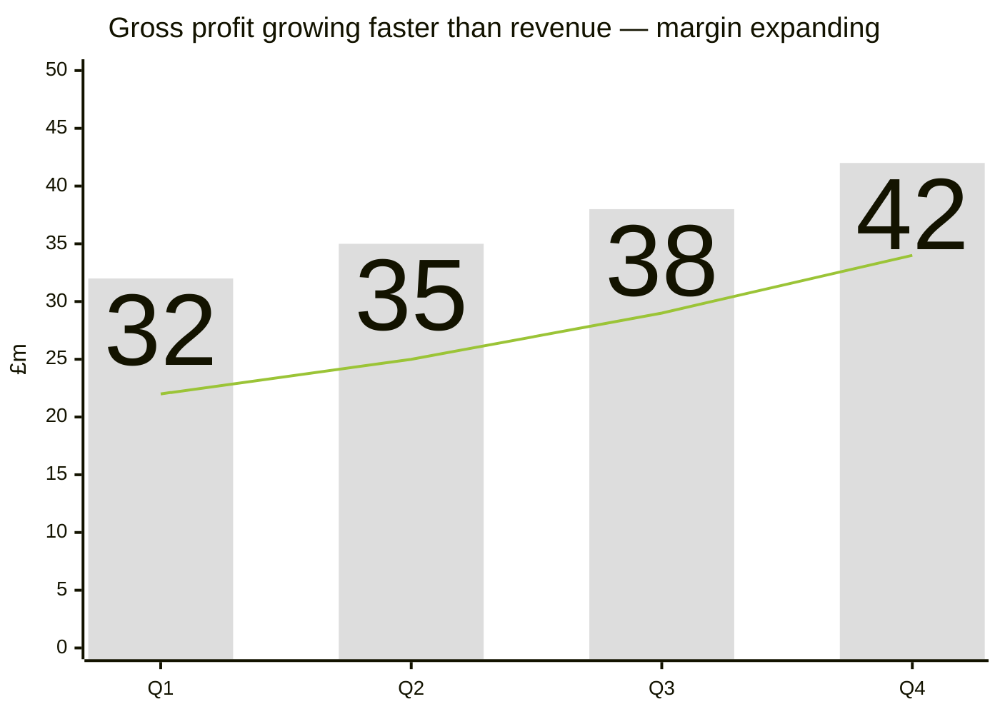

**Tips:**

- Mermaid `xychart` uses a single y-axis, so this works best when both series share a similar scale
- If the series have very different scales (e.g., £m revenue + % margin), use two separate charts or a table instead — dual-axis charts are often misleading
- Label the series in a note below the chart: "Bars = revenue, Line = gross profit"

---

## Why not pie charts

Avoid pie charts. Human perception is poor at comparing angles and areas — we consistently misjudge the relative size of pie slices. Better alternatives:

- **Bar chart** — for comparing parts of a whole (far easier to read)
- **Table** — when exact numbers matter
- **Stacked bar** — if you must show composition across multiple groups

---

## When NOT to use a diagram

Use a **table** instead of a diagram when:

- You're comparing options across multiple criteria (decision matrix)
- You're presenting exact numbers (financial data, metrics)
- The information is linear, not spatial (lists, sequences without branching)
- You need more than 20 items — tables scale, diagrams don't

Use **prose** instead of a diagram when:

- The narrative is more important than the structure
- The relationships are nuanced and don't reduce to boxes and arrows
- You'd need extensive annotation to make the diagram understandable

**Test:** If you need more than 2 sentences of explanation below a diagram to make it comprehensible, the diagram isn't doing its job. Simplify it or switch to a table/prose.
